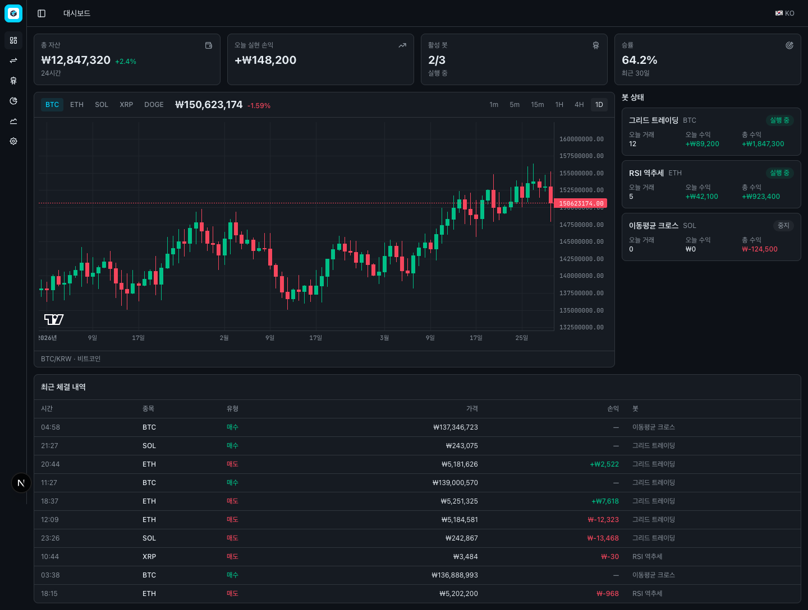
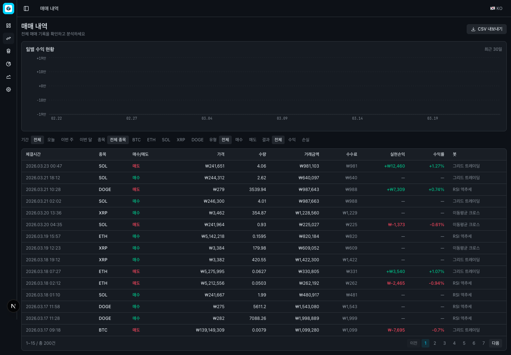
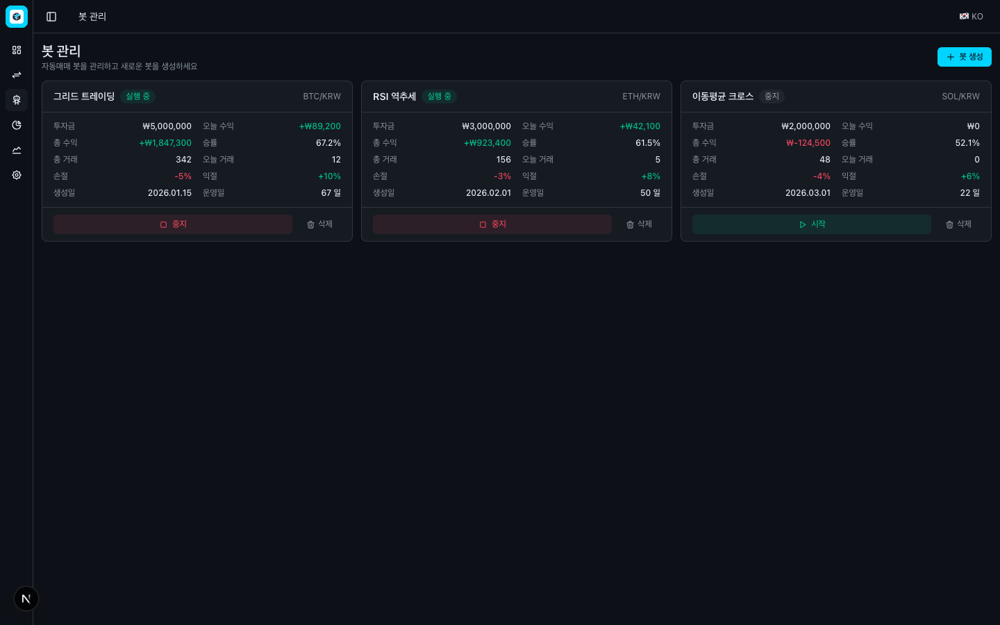
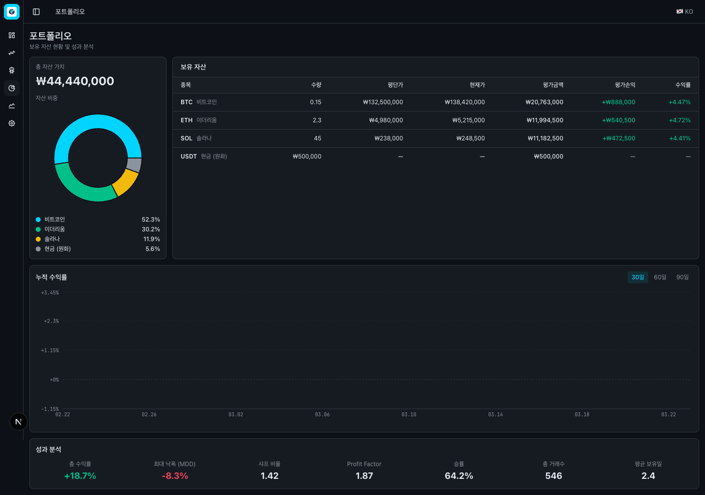
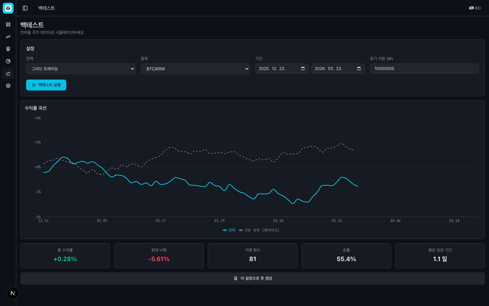
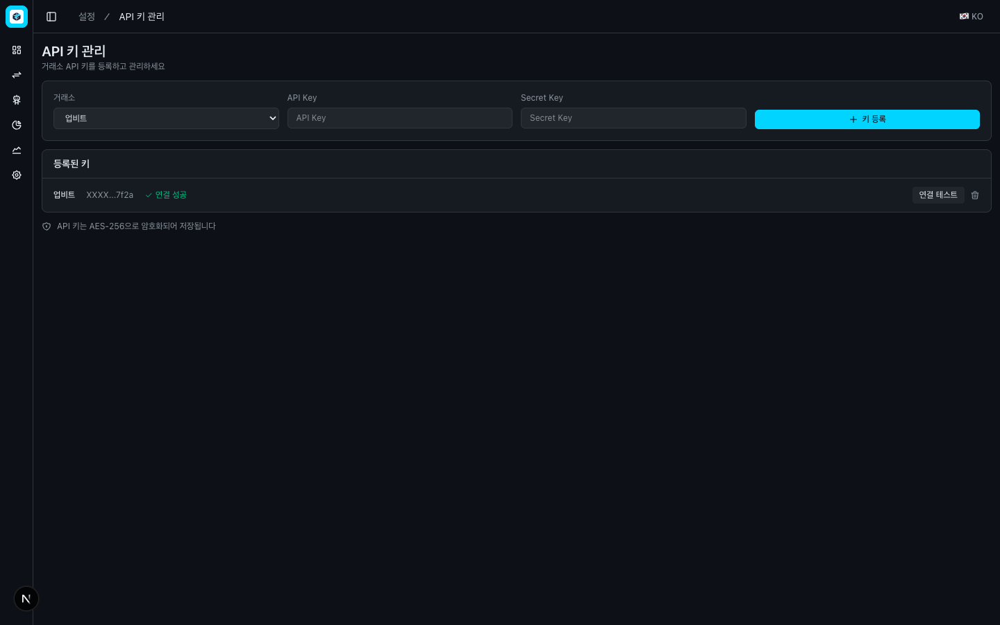
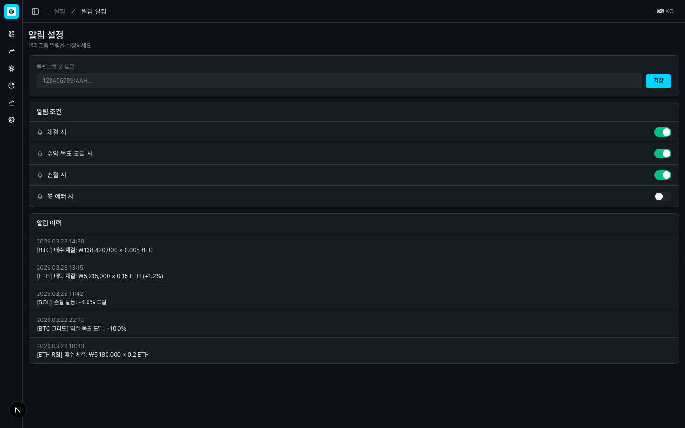
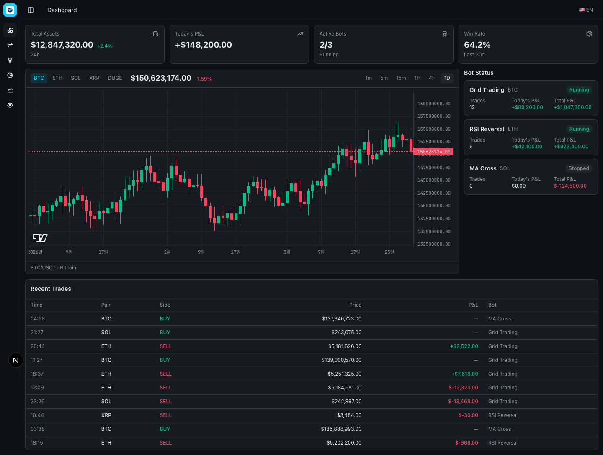

# TradeForge — 자동매매 모니터링 대시보드

> Crypto Trading Bot Dashboard — 자동매매 트레이딩 봇 모니터링 대시보드

[](https://nextjs.org/)
[](https://www.typescriptlang.org/)
[](https://tailwindcss.com/)
[](https://www.tradingview.com/lightweight-charts/)

## Demo

> 🔗 **[Live Demo →](https://trade-forge-psi.vercel.app)**

## Screenshots

### Dashboard — 대시보드
통계 카드, BTC/KRW 캔들스틱 차트 (5개 종목 전환), 봇 상태, 최근 체결 내역



### Trade History — 매매 내역
200건 매매 로그, 필터 (기간/종목/유형/결과), 일별 수익 바 차트, CSV 내보내기



### Bot Management — 봇 관리
3개 봇 카드 (투자금/수익/승률), 시작/중지 토글, 봇 생성 모달 (4가지 전략)



### Portfolio — 포트폴리오 분석
자산 비중 도넛 차트, 보유 종목 테이블, 누적 수익률 라인 차트, 핵심 지표 7개



### Backtest — 백테스트
전략 시뮬레이션, 수익률 곡선 vs 벤치마크(단순 보유) 비교, 결과 요약



### Settings — 설정
API 키 관리 (거래소 3곳, 마스킹, 연결 테스트) + 알림 설정 (텔레그램, 조건 토글)

| API 키 관리 | 알림 설정 |
|:---:|:---:|
|  |  |

### English UI — 영어 전환
한국어/영어 원클릭 전환 (모든 UI 텍스트, 금액 단위, 종목명)



## Features

- **대시보드**: 총 자산, 오늘 손익, 활성 봇, 승률 + BTC/KRW 캔들스틱 차트 (lightweight-charts)
- **매매 내역**: 200건 매매 로그, 4종 필터, 페이지네이션, 일별 수익 바 차트, CSV 내보내기
- **봇 관리**: 봇 카드 리스트, 시작/중지 토글, 봇 생성 모달 (그리드/RSI/이평선/볼린저)
- **포트폴리오**: 자산 비중 도넛 차트, 누적 수익률 (30/60/90일), 핵심 지표 (MDD, 샤프 비율 등)
- **백테스트**: 전략 시뮬레이션, 벤치마크 비교, 결과 요약, "이 설정으로 봇 생성" 연동
- **설정**: API 키 관리 (업비트/빗썸/바이낸스), 알림 설정 (텔레그램)
- **다국어**: 한국어/영어 원클릭 전환 (next-intl)
- **다크 테마**: 트레이딩 터미널 다크 UI (바이낸스/업비트 스타일)

## Tech Stack

| Category | Technology |
|:---|:---|
| Framework | Next.js 16 (App Router) |
| Language | TypeScript (strict) |
| Styling | Tailwind CSS v4 + shadcn/ui |
| Charts | lightweight-charts (캔들스틱), Recharts (바/라인/파이) |
| i18n | next-intl (한국어/영어) |
| Font | JetBrains Mono (숫자/금액), Pretendard (한글) |
| Deployment | Vercel |

## Getting Started

```bash
# Clone
git clone https://github.com/tellmefrankie/trade-forge.git
cd trade-forge

# Install dependencies
pnpm install

# Development
pnpm dev

# Build
pnpm build
```

Open [http://localhost:3000](http://localhost:3000) in your browser.

## Project Structure

```
src/
├── app/(app)/           # Pages (dashboard, trades, bots, portfolio, backtest, settings)
├── components/
│   ├── charts/          # CandlestickChart, DailyPnlBarChart, AssetDonutChart, ProfitLineChart
│   ├── trading/         # StatCard, BotStatusCard, ChartPanel, RecentTradesTable, CreateBotModal
│   ├── layout/          # AppSidebar, Header, LanguageToggle
│   └── ui/              # shadcn/ui components
├── data/mock/           # Mock data (candles, trades, bots, portfolio, backtest)
├── i18n/                # next-intl configuration
├── lib/                 # Utilities (format, data-table)
└── styles/themes/       # TradeForge dark theme CSS
messages/
├── ko.json              # 한국어
└── en.json              # English
```

## License

MIT

---

Built by [CodeFoundry](https://github.com/tellmefrankie)
